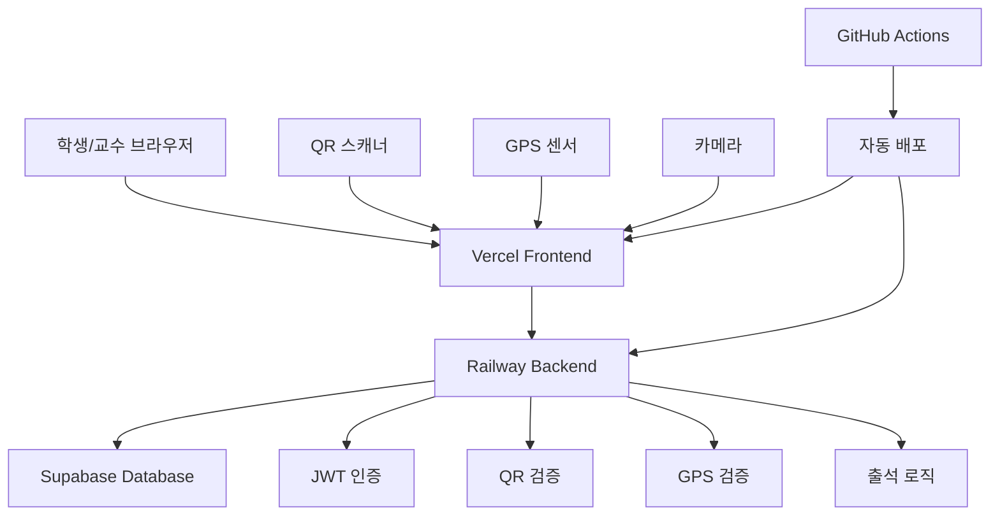

# 🎓 대학 출석관리시스템

> QR코드 + GPS + 2차 인증을 통한 스마트 출석 관리 솔루션

[](https://github.com/your-username/attendance-management/actions)
[](https://opensource.org/licenses/MIT)
[](https://www.typescriptlang.org/)
[](https://reactjs.org/)
[](https://expressjs.com/)

## 📋 목차

- [프로젝트 소개](#-프로젝트-소개)
- [주요 기능](#-주요-기능)
- [기술 스택](#-기술-스택)
- [시스템 아키텍처](#-시스템-아키텍처)
- [빠른 시작](#-빠른-시작)
- [배포 가이드](#-배포-가이드)
- [API 문서](#-api-문서)
- [기여하기](#-기여하기)
- [라이선스](#-라이선스)

## 🎯 프로젝트 소개

대학 출석관리시스템은 전통적인 출석 체크 방식의 한계를 극복하고, 대리출석을 방지하기 위해 개발된 웹 애플리케이션입니다.

### ✨ 핵심 특징

- **🔒 3단계 보안 인증**: QR 스캔 → GPS 위치 확인 → 2차 인증코드
- **📱 모바일 최적화**: 반응형 디자인으로 모든 기기에서 완벽 동작
- **📊 실시간 통계**: 교수용 실시간 출석 현황 및 통계 대시보드
- **🗺️ GPS 정확도 조정**: 위치 정확도에 따른 동적 반경 조정
- **⚡ 실시간 업데이트**: 출석 현황 실시간 반영

## 🚀 주요 기능

### 👨‍🏫 교수 기능
- **강의 관리**: 강의 생성, 수정, GPS 위치 설정
- **QR 코드 생성**: 시간 제한이 있는 보안 QR 코드 생성
- **출석 세션 관리**: 세션 활성화/비활성화, 실시간 모니터링
- **통계 및 분석**: 학생별/세션별 출석률 분석, CSV 내보내기
- **수동 출석 처리**: 특별한 상황에서의 수동 출석 승인

### 👨‍🎓 학생 기능
- **QR 스캔 출석**: 카메라 또는 수동 입력으로 QR 스캔
- **GPS 위치 인증**: 강의실 위치 자동 확인
- **출석 기록 조회**: 개인 출석 이력 및 통계 확인
- **실시간 피드백**: 출석률 및 권장사항 제공
- **위치 테스트**: 사전 GPS 정확도 테스트

### 🔐 보안 기능
- **JWT 인증**: 안전한 토큰 기반 인증
- **HMAC QR 서명**: QR 코드 위변조 방지
- **Rate Limiting**: API 남용 방지
- **역할 기반 접근**: 학생/교수 권한 분리
- **감사 로그**: 모든 출석 활동 기록

## 🛠️ 기술 스택

### Frontend
- **React 18** - 모던 UI 라이브러리
- **TypeScript** - 타입 안전성
- **Ant Design** - 일관된 UI/UX
- **React Router** - 클라이언트 사이드 라우팅
- **Styled Components** - CSS-in-JS 스타일링
- **Axios** - HTTP 클라이언트

### Backend
- **Node.js & Express** - 서버 사이드 런타임
- **TypeScript** - 타입 안전한 백엔드
- **JWT** - 인증 토큰
- **bcrypt** - 패스워드 해싱
- **QRCode** - QR 코드 생성
- **Zod** - 스키마 검증

### Database & Infrastructure
- **Supabase (PostgreSQL)** - 관리형 데이터베이스
- **Vercel** - 프론트엔드 배포
- **Railway** - 백엔드 배포
- **Docker** - 컨테이너화

### DevOps & Tools
- **GitHub Actions** - CI/CD 파이프라인
- **ESLint & Prettier** - 코드 품질
- **Jest** - 테스팅 프레임워크
- **Nginx** - 리버스 프록시

## 🏗️ 시스템 아키텍처



## 🚀 빠른 시작

### 사전 요구사항
- Node.js 18.0.0 이상
- npm 8.0.0 이상
- Supabase 계정

### 로컬 개발환경 설정

1. **저장소 클론**
```bash
git clone https://github.com/your-username/attendance-management.git
cd attendance-management
```

2. **백엔드 설정**
```bash
cd backend
npm install
cp .env.development.template .env.development
# .env.development 파일에서 Supabase 설정 업데이트
npm run dev
```

3. **프론트엔드 설정**
```bash
cd frontend
npm install --legacy-peer-deps
npm start
```

4. **데이터베이스 설정**
- Supabase에서 새 프로젝트 생성
- `database/schema.sql` 실행
- `database/schema-update.sql` 실행

자세한 설정 방법은 [개발환경 가이드](./DEVELOPMENT.md)를 참조하세요.

## 🌐 배포 가이드

### 프로덕션 배포

1. **Supabase 프로덕션 DB 생성**
2. **Railway 백엔드 배포**
3. **Vercel 프론트엔드 배포**

상세한 배포 과정은 [배포 가이드](./DEPLOYMENT.md)를 참조하세요.

### Docker 배포

```bash
# 전체 스택 실행
docker-compose up -d

# 개별 서비스 실행
docker-compose up backend
docker-compose up frontend
```

## 📚 API 문서

### 주요 엔드포인트

#### 인증 API
```http
POST /api/auth/register    # 회원가입
POST /api/auth/login       # 로그인
POST /api/auth/refresh     # 토큰 갱신
GET  /api/auth/me          # 사용자 정보
```

#### 출석 API
```http
POST /api/attendance/sessions              # 세션 생성
POST /api/attendance/sessions/:id/generate-qr  # QR 생성
POST /api/attendance/check                 # QR 출석 체크
POST /api/attendance/verify-location       # GPS 위치 검증
POST /api/attendance/verify-auth-code      # 인증코드 확인
```

#### 통계 API
```http
GET /api/attendance/my-records             # 개인 출석 기록
GET /api/attendance/my-stats               # 개인 통계
GET /api/attendance/professor/sessions     # 교수 세션 목록
GET /api/attendance/professor/course-stats # 강의 통계
```

전체 API 문서는 서버 실행 후 `/api-docs`에서 확인할 수 있습니다.

## 🎨 스크린샷

### 교수용 대시보드


### 학생용 출석 체크


### 실시간 통계


## 🧪 테스트

### 단위 테스트 실행
```bash
# 백엔드 테스트
cd backend
npm test

# 프론트엔드 테스트
cd frontend
npm test
```

### 통합 테스트 실행
```bash
# 백엔드 서버 실행 후
node test-integration.js
```

## 📊 성능 및 보안

### 성능 최적화
- **코드 분할**: React.lazy를 통한 번들 최적화
- **이미지 최적화**: 최적화된 이미지 포맷 사용
- **캐싱**: API 응답 캐싱 및 정적 자원 캐싱
- **CDN**: Vercel Edge Network 활용

### 보안 조치
- **HTTPS 강제**: 모든 통신 암호화
- **XSS 방지**: Content Security Policy
- **CSRF 방지**: SameSite 쿠키 설정
- **SQL 인젝션 방지**: Prepared Statement 사용

## 🤝 기여하기

1. Fork the Project
2. Create your Feature Branch (`git checkout -b feature/AmazingFeature`)
3. Commit your Changes (`git commit -m 'Add some AmazingFeature'`)
4. Push to the Branch (`git push origin feature/AmazingFeature`)
5. Open a Pull Request

### 개발 가이드라인
- TypeScript 사용 필수
- ESLint 규칙 준수
- 테스트 코드 작성
- 커밋 메시지 컨벤션 따르기

## 📝 변경 로그

### v1.0.0 (2024-09-08)
- ✨ 3단계 보안 출석 시스템 구현
- 📱 모바일 반응형 UI 완성
- 📊 실시간 통계 대시보드
- 🚀 프로덕션 배포 환경 구축
- 🧪 통합 테스트 시스템 구축

자세한 변경사항은 [CHANGELOG.md](./CHANGELOG.md)를 참조하세요.

## 🔧 문제 해결

일반적인 문제와 해결방법은 [FAQ](./docs/FAQ.md)를 확인하세요.

### 자주 발생하는 이슈
- **GPS 정확도 문제**: 실외에서 테스트하거나 위치 권한 확인
- **QR 스캔 실패**: 카메라 권한 확인 또는 수동 입력 사용
- **API 연결 오류**: CORS 설정 및 환경변수 확인

## 📄 라이선스

이 프로젝트는 MIT 라이선스를 따릅니다. 자세한 내용은 [LICENSE](./LICENSE) 파일을 참조하세요.

## 👥 개발팀

- **기획 및 설계**: Claude Code
- **백엔드 개발**: Claude Code  
- **프론트엔드 개발**: Claude Code
- **DevOps**: Claude Code

## 📞 지원 및 연락

- 🐛 버그 리포트: [GitHub Issues](https://github.com/your-username/attendance-management/issues)
- 💡 기능 제안: [GitHub Discussions](https://github.com/your-username/attendance-management/discussions)
- 📧 이메일: your-email@example.com

---

<div align="center">

**⭐ 이 프로젝트가 도움이 되셨다면 스타를 눌러주세요! ⭐**

</div>